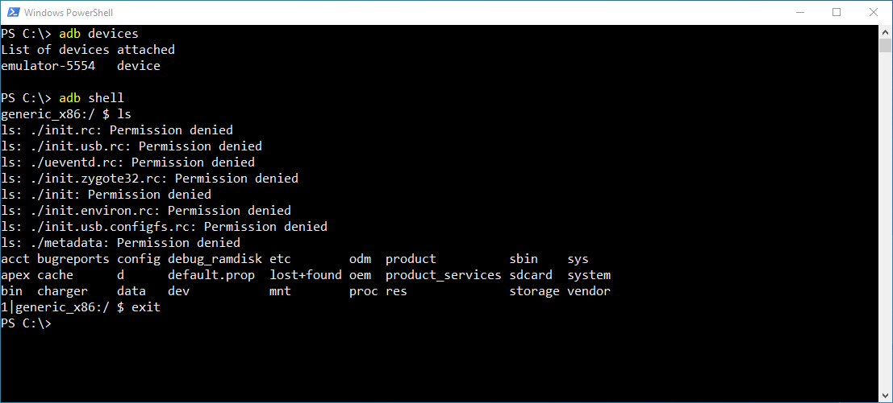

# adb (Android Debug Bridge)

`adb` ist ein Kommandozeilenprogramm mit dem unterschiedliche Aufgaben auf einem verknüpften Android Gerät ausgeführt werden können. Am verknüpfen Android Gerät läuft ein Dienst (Daemon) `adbd`, welcher über das Kommandozeilenprogramm `adb` auf dem Entwicklungsrechner angesprochen werden kann.

Mit der Installation von Android Studio wird `adb` am Entwicklungsrechner installiert und kann über die Kommandozeile genutzt werden.



# Beispiele

### Verknüpfte Geräte auflisten

```
> adb devices
```

### Daten auf das Gerät laden (push)

```
> adb push C:\lokale-datei.txt /sdcard/pushedfile.txt
```

### Daten vom Gerät herunterladen (pull)

```
> adb pull /sdcard/remotefile.txt C:\lokale-remote-datei.txt
```

### Shell

Über `adb` kann man sich auf die Linux-Shell des Android-Geräts einloggen.

```
> adb shell
```

#### Impliziten Intent starten

```
> adb shell
> am start -a android.intent.action.SENDTO -d sms:+43234235235 -e sms_body "hello world"
```

#### Screenshot machen und herunterladen

```
> adb shell
> screencap /sdcard/screenshot.png
> exit
> adb pull /sdcard/screenshot.png ./screenshot.png
```
