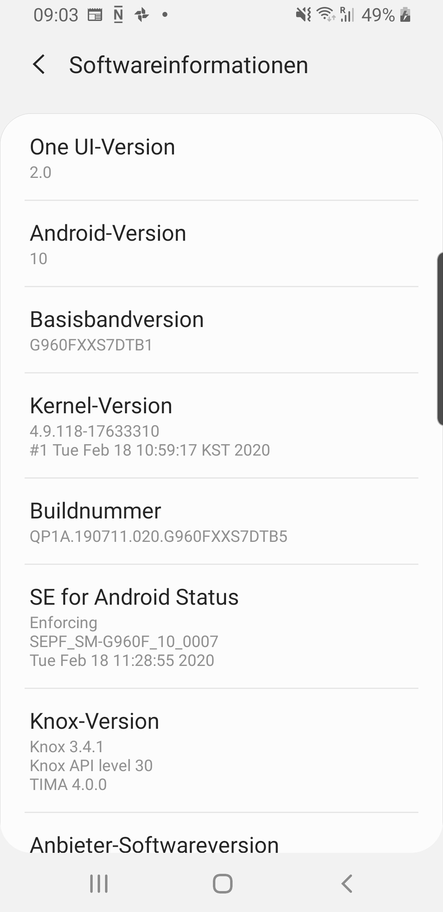
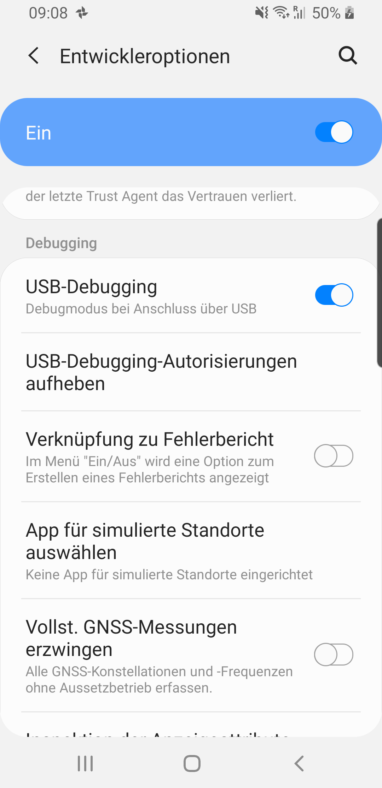

# Apps ausführen

Um ein App Projekt, welches über Android Studio geöffnet wurde, auszuführen bestehen generell 2 Möglichkeiten. Entweder kann das Projekt innerhalb eines `Emulators` ausgeführt werden oder auf einem `Android Gerät` das über USB oder Wifi mit dem Entwicklungsrechner verknüpft ist.

Verfügbare Geräte werden im Dropdown neben dem Play-Button angezeigt. Nach Auswahl eines entsprechenden Gerätes kann die App darauf gestartet werden (Klick auf den Play-Button).

## Emulator

Der Emulator simuliert ein echtes Android Gerät und bietet nahezu alle Funktionen, welche auch ein richtiges Android Gerät bietet. Als System-Vorausetzung um Emulatoren zu nutzen muss Intel® HAXM installiert werden. 

 - [Download von Intel® HAXM](https://github.com/intel/haxm/releases)
 - [Troubleshooting Intel® HAXM](https://software.intel.com/content/www/us/en/develop/blogs/troubleshooting-intel-haxm.html)
 - [Troubleshooting von Android](https://developer.android.com/studio/run/emulator-troubleshooting)

Der Erstellung und Verwendung von Emulatoren ist grundsätzlich sehr intuitiv und benötigt wenig Erklärung. Alle Details zu Emulatoren finden sich in der Android Dokumentation ([Emulatoren](https://developer.android.com/studio/run/emulator)).

## Android Gerät

Die Ausführung der App ist am Android Smartphone oft schneller und einfacher als am Emulator. Damit ein Smartphone zur Ausführung von Apps in Entwicklung verwendet werden kann, müssen die Entwickleroptionen freigeschalten werden:

### Entwickleroptionen freischalten

Dazu muss am Android Smartphone in `Einstellungen > Telefoninfo` nach der Buildnummer gesucht werden. Diese findet sich zB unter `Einstellungen > Telefoninfo > Softwareinformationen`. Es muss dann ca. 7-mal auf die Buildnummer geklickt werden, dann werden die Entwickleroptionen freigeschalten.

{: style="max-width:260px;" }

### USB-Debugging aktivieren

Nachdem die Entwickleroptionen freigeschalten wurden, finden sich diese unter `Einstellungen > Entwickleroptionen`. Dort muss USB-Debugging aktiviert werden und das Smartphone muss über USB-Kabel am Rechner angeschlossen sein.

{: style="max-width:260px;" }