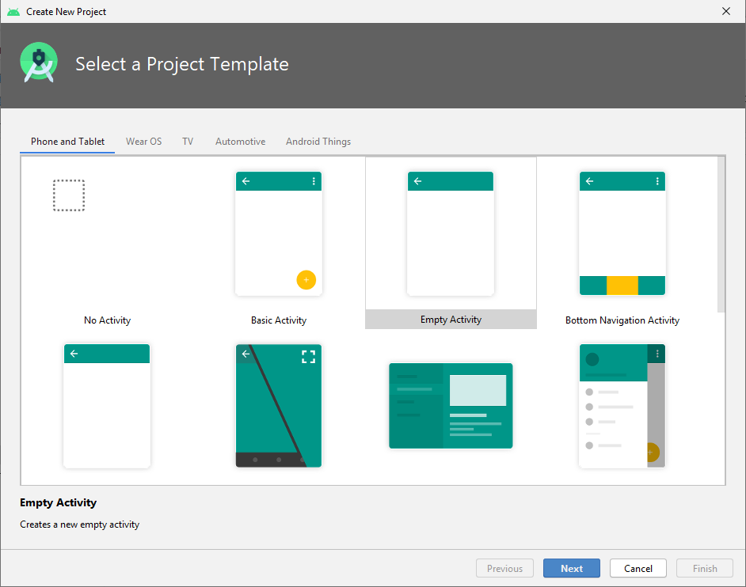

# Neues Projekt erstellen

Über den Projekt-Wizard wird man durch den Erstellungsprozess eines neues Android Projektes geleitet. 

## Neues Projekt

Nachdem ersten Start von Android Studio ist die Ansicht, wie unten im Screenshot dargestellt, vorhanden. Dabei kann über Klick auf `+ Start a new Android Studio project` ein neues Projekt erstellt werden. 

Alternativ kann über die geöffnete Android Studio Projektansicht über das Menü `File > New > New Project...` ein neues Projekt erstellt werden.

## Erste Activity wählen

Mit dem Projekt-Wizard können Android Projekte für die Plattformen `Phone and Tablet`, `Wear OS`, `TV`, `Automotive` und `Android Things` erstellt werden. Unser Fokus liegt dabei auf `Phone and Tablet`.

Ein Android Projekt besteht normalerweise zumindest aus einer Activity. Ein großes Android Projekt kann durchaus über Hundert Activities umfassen. Für ein neues Projekt kann aus unterschiedlichen Templates für die erste Activity gewählt werden. Für die meisten unserer Projekte wählen wir das Template `Empty Activity`.

 Projektkonfiguration

## Projektkonfiguration

Im letzten Schritt des Projekt-Wizard werden wichtige Daten zum Projekt festgelegt. All diese Daten können grundsätzlich später noch verändert werden, dies ist dann aber teilweise mit aufwändigen Refactoring verbunden.

Folgende Parameter können festgelegt werden:

 - __Name:__ Der Name wird an allen wichtigen Stellen im Android Betriebssystem für die App angezeigt (zB am All-Apps Screen oder am Recents Screen).
 - __Package name:__ Alle Klassen des Projektes werden mit diesem Package Name versehen.
 - __Save location:__ An dieser Stelle wird das Projekt am Dateisystem gespeichert.
 - __Language:__ Native Android Apps können grundsätzlich in Java oder Kotlin entwickelt werden.
 - __Minimum SDK:__ Auswahl der SDK Version die mindestens unterstützt werden soll (siehe unten).

### Minimum SDK wählen

Für Android wird zumindest jährlich eine neue Version (inkl. SDK) veröffentlicht. Die Auswahl hängt davon ab, welche älteren Android Versionen von der App noch unterstützt werden sollen. Im Screenshot ist ersichtlich, dass neuere Android Versionen global eine sehr geringe Verbreitung haben. Das Ziel eines Projektes sollte grundsätzlich sein, dass ein große Zahl von Benutzern die App uneingeschränkt benutzen können. Eine Unterstützung von mind. `80%` ist in den meisten Fällen eine gute Wahl.

!!! check "Projekt erstellen"
    Wählen Sie die Parameter um Ihr geplantes Projekt zu erstellen und klicken Sie auf `Finish`.

