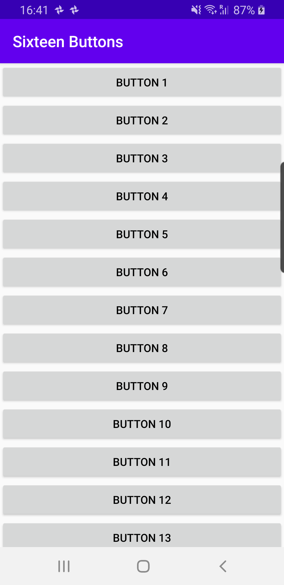
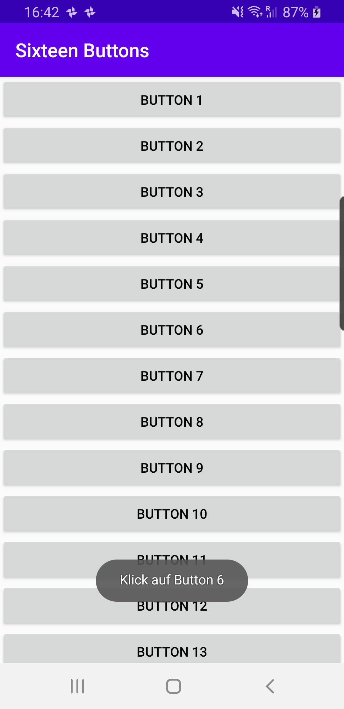

# Übungsblatt 1

## Übung 0

Die Android Dokumentation stellt ein gut dokumentiertes Tutorial ["Build your first app"](https://developer.android.com/training/basics/firstapp) bereit. Dieses Tutorial soll Schritt für Schritt durchgeführt werden.

## Übung 1 (1,5 h)

Erstellen Sie eine neue App mit dem Namen „Sixteen Buttons“. Diese App soll einen Screen besitzen und ein Layout. Das Layout soll dabei ein `LinearLayout` sein, welches **programmatisch** beim Start der Activity mit 16 Buttons befüllt wird (siehe Screenshot). Wichtig zu beachten ist, dass das `LinearLayout` von einer `ScrollView` umgeben sein soll, sodass Buttons die nicht in den Screen passen durch Scrollen erreichbar sind. Die Buttons sollen mit dem Text `Button 1` bis `Button 16` beschriftet sein.

{: style="max-width:260px;" }

!!! info "Hinweis"
    Die 16 Buttons sollen innerhalb einer Schleife in der Methode `onCreate` hinzugefügt werden. Mit der Methode `findViewById` kann das `LinearLayout` im Java Code referenziert werden. Das `LinearLayout` erbt von `ViewGroup` und verfügt deshalb über die Methode `addView`. Mit der Methode `addView` können die Buttons dem Layout hinzugefügt werden.

## Übung 2 (1,5 h)

Mit Klick auf einen der Buttons soll ein `Toast` abgesetzt werden. Der Inhalt des Toasts soll "Klick auf Button x" sein. Dabei soll der Platzhalter x mit der entsprechenden Nummerierung des Buttons ausgetauscht werden. Hierbei kann der Wert der Button Aufschrift genutzt werden, welche in Übung 1 gesetzt wurde. Mit der Methode `getText` der Klasse Button kann dieser Wert abgefragt werden.

{: style="max-width:260px;" }

## Übung 3 (3h)

Das Projekt soll nun zu einem kleinen Spiel weiterentwickelt werden.

 1. Nach dem Zufallsprinzip soll ein Button aus der Liste ausgewählt werden und mit einer roten Schriftfarbe versehen werden.
 2. Nur beim Klick auf den Button mit der roten Schrift soll der Toast aus Übung 2 abgesetzt werden.
 3. Nachdem auf den Button mit roter Schrift geklickt wurde, soll wieder zu Schritt 1 übergegangen werden und ein neuer zufälliger Button eine rote Schriftfarbe bekommen.

{: style="max-width:260px;" }

!!! info "Hinweis"
    Das `LinearLayout` besitzt die Methoden `getChildCount` und `getChildAt`. Jedes Kind des `LinearLayout` kann über einen Index abgefragt werden, die Indizes liegen dabei zwischen `0` und `getChildCount - 1` (ähnlich wie bei Arrays). Mit der Methode `setTextColor` kann eine Farbe gesetzt werden. Mit der Methode `getCurrentTextColor` kann die aktuelle Farbe abgefragt werden. Mit statischen Methoden und Eigenschaften der Klasse `Color` können entsprechende Farbwerte erzeugt werden.

## Übung 4 (4h)

Mit Klick auf den ersten Button mit roter Schrift soll ein Timestamp (`System.currentTimeMillis`) erstellt werden. Nachdem gesamt 5 Buttons mit roter Schrift geklickt wurden, soll die Zeitspanne seit dem ersten erfolgreichen Klick errechnet werden. Dannach soll eine weitere Activity (`GameOverActivity`), mittels Intent, gestartet werden und als `Extra` soll die Zeitspanne übergeben werden. Die `GameOverActivity` soll folgendes Layout haben:

{: style="max-width:260px;" }

Mit Klick auf den Button `Neustart` soll das Spiel "Sixteen Buttons" wieder gestartet werden. Wichtig ist dabei, dass der Timestamp bei Klick auf den ersten Button mit roter Schrift wieder zurückgesetzt wird und das Spiel kann wieder gestartet werden.

!!! info "Hinweis"
    Die Navigation zwischen den einzelnen `Activities` wird über `Intents` durchgeführt. Damit die jeweiligen `Activities` nicht mehrmals auf den `Back Stack` gelegt werden, sollten die `Intents` mit dem Flag `FLAG_ACTIVITY_CLEAR_TOP` versehen werden. Dazu soll die Methode `addFlags` verwendet werden. Das folgende Snippet soll dies veranschaulichen:

        Intent intent = new Intent(...);
        intent.addFlags(Intent.FLAG_ACTIVITY_CLEAR_TOP);
        startActivity(intent);
