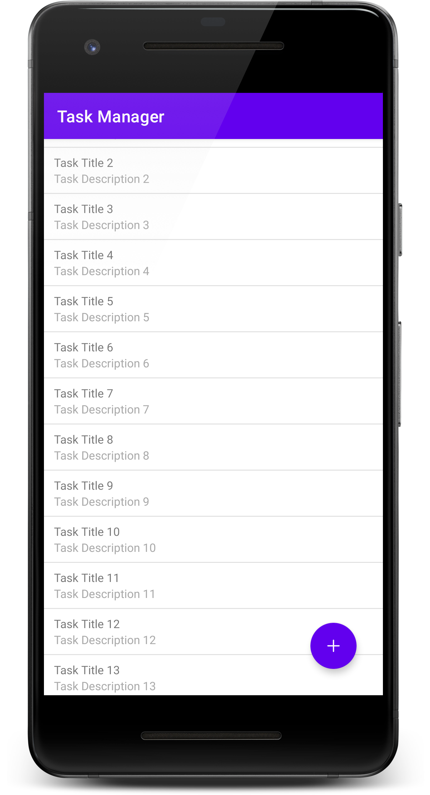
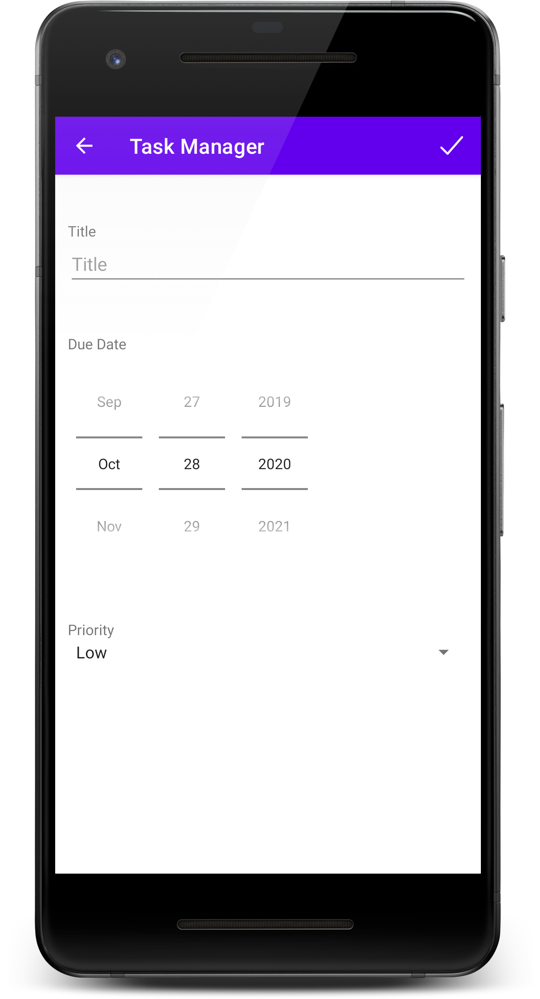

# Übungsblatt 3

## Übung 0

In der Übung 0 soll gemeinsam die Grundlage für die App `Task Master` entwickelt werden. Es sollen über das Room Framework eigene Tasks verwaltet werden können. Ein Task soll dabei folgenden Aufbau haben:

```java
@Entity
class Task {
    @PrimaryKey(autoGenerate=true)
    public int id;
    public String title;
    public String priority;
    public Date dueDate;
}
```

## Übung 1 (1h)

Es sollen einige kosmetische Änderungen vorgenommen werden:

 - Zwischen den einzelnen Listenelementen sollen Trennlinien erstellt werden. Dazu können sog. Dekoratoren (`ItemDecoration`) für die RecyclerView verwendet werden. Über die Methode `addItemDecoration` kann eine Instanz der Klasse `DividerItemDecoration` übergeben werden.
 - Es soll ein `FloatingActionButton` am rechten unteren Rand hinzugefügt werden. Bei Klick auf diesen Button soll eine neue Activity (`ManageTaskActivity`) geöffnet werden.
 - Der `FloatingActionButton` soll mit einem Icon ausgestattet werden. Suchen Sie dazu ein passendes SVG Icon im Internet (zB [Ionicons](https://ionicons.com/), [FontAwesome](https://fontawesome.com/), [Feather Icons](https://feathericons.com/)). Im Android Studio kann das SVG-Icon über `File > New > Vector Asset` als `Drawable` im Projekt hinzugefügt werden.

{: style="max-width:260px;" }

## Übung 2 (1h)

Das Erscheinungsbild der Activity `ManageTaskActivity` soll entsprechend gestaltet werden. Im ersten Schritt sollen die Formularfelder erstellt werden. Jedes Formularfeld hat links oben eine `TextView` als Label positioniert. Folgende Formularfelder kommen zum Einsatz:

 - Für den Titel des Tasks soll ein `EditText` zum Einsatz kommen.
 - Für die Auswahl des Datums soll ein `DatePicker` verwendet werden. Dabei sollen die Attribute `datePickerMode` als `spinner` und `calendarViewShown` als `false` gesetzt werden.
 - Für die Auswahl der Priorität soll ein `Spinner` im `spinnerMode` `dialog` verwendet werden. Die Einträge im `Spinner` können über das Attribut `entries` gesetzt werden. Dazu muss ein `string-array` als `Resource Type` `Values` angelegt werden und mit dem `Spinner` verknüpft werden.

{: style="max-width:260px;" }

## Übung 3 (1h)

Im nächsten Schritt soll die `ActionBar` der `ManageTaskActivity` noch entsprechend angepasst werden:

 - Im Manifest soll für die Activity als `parentActivityName` die `MainActivity` eingetragen werden. Dies erzeugt den Zurückbutton in der `ActionBar`.
 - Rechts in der `ActionBar` soll ein Button zum Speichern erzeugt werden. Hierfür soll wiederum ein passendes SVG Icon ausgewählt werden und als `Vector Asset` importiert werden. Um den Button zu erzeugen, muss eine Menü-Ressource erstellt werden. Dies wird mit Rechtsklick auf den `res` Ordner und der Auswahl `New Resource File` erstellt. Als `Resource Type` soll `Menu` ausgewählt werden. Im `<menu>` XML-Element muss ein entsprechendes `<item>` hinzugefügt werden (Icon muss ausgewählt werden und `showAsAction` soll auf `always` gesetzt werden). Die Vorschaut kann in Android Studio genutzt werden, ähnlich wie bei der Erstellung von Layouts.
 - In der `ManageTaskActivity` muss nun die Methode `onCreateOptionsMenu` überschrieben werden und das Menü "Inflated" werden. Über die Methode `getMenuInflator` kann eine Instanz der Klasse `MenuInflator` abgefragt werden, dieser besitzt die Methode `inflate`, welche genutzt werden soll.

## Übung 4 (2h)

Mit Klick auf den Button zum Speichern in der `ManageTaskActivity` soll ein neues Task Objekt erzeugt werden und dieses über das entsprechende `DAO` gespeichert werden. Der Klick auf den Button in der `ActionBar` kann über die Implementierung der Methode `onOptionsItemSelected` abgefangen werden.  Nach dem Speichern soll die `MainActivity` gestartet werden und der neue Task sollte dort sichtbar sein.

## Übung 5 (2h)

Innerhalb der `MainActivity` soll es möglich sein, dass auf einen Listeneintrag geklickt wird. Ein Klick soll dabei die `ManageTaskActivity` öffnen und den Listeneintrag zum editieren anzeigen. Damit die `ManageTaskActivity` entscheiden kann, ob sie im `Create` oder `Update` Modus ist soll die `id` des Tasks innerhalb des Intents mitgegeben werden. Im `Update` Modus sollen die Formularfelder die Inhalte des Tasks laden und zum editieren bereitstellen. Bei Klick auf Speichern soll der Task in der Datenbank überschrieben (`Update`) werden.

## Übung 6 (3h)

Mit einer Swipe Geste nach Links sollen Einträge aus der Liste in der `MainActivity` entfernt werden können. Dazu kann die Klasse `ItemTouchHelper` verwendet werden. Mit einem Callback (hier `SimpleCallback`) kann das bewegen eines Listen Eintrags bewerkstelligt werden.

```java
ItemTouchHelper touchHelper = new ItemTouchHelper(new ItemTouchHelper.SimpleCallback(ItemTouchHelper.LEFT, ItemTouchHelper.LEFT) {
    @Override
    public boolean onMove(@NonNull RecyclerView recyclerView, @NonNull RecyclerView.ViewHolder viewHolder, @NonNull RecyclerView.ViewHolder target) {
        return false;
    }

    @Override
    public void onSwiped(@NonNull RecyclerView.ViewHolder viewHolder, int direction) {
        
        // Position in der Datenquelle abfragen
        int position = viewHolder.getAdapterPosition();

        // löschen durchführen, dazu muss im Adapter eine Löschen Operation implementiert werden
        // Nachdem Löschen in der Datenbank müssen die Daten im Adapter neu geladen werden
        // ansonsten laden sich die Einträge in der RecyclerView nicht neu, nachdem Neuladen
        // muss im Adapter die Methode notifyDataSetChanged(); aufgerufen werden
    }
});

// Instanz der RecyclerView übergeben
touchHelper.attachToRecyclerView(...);
```

Mittels einer `Snackbar` soll am unteren Bildschirmrand angezeigt werden, dass der Eintrag entfernt wurde.
