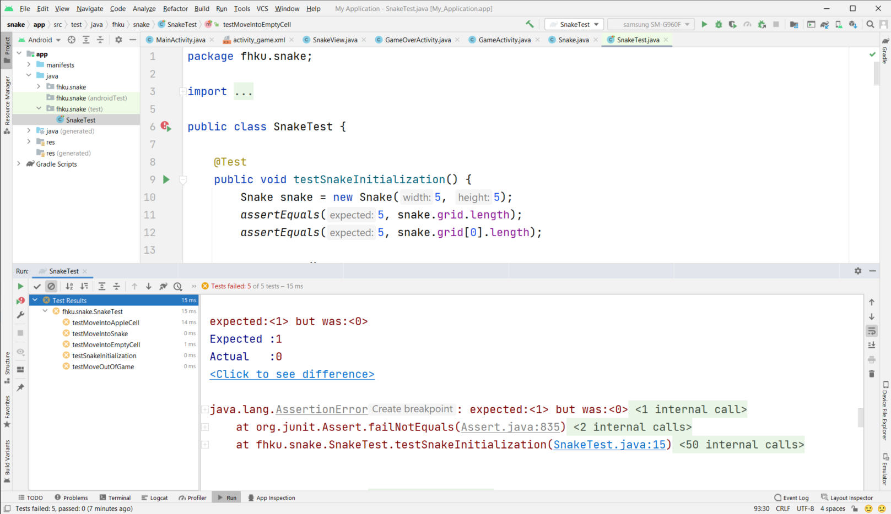

# Übungsblatt 4: Snake

## Projektübersicht

Im Projekt finden Sie 3 `Activities`. Jeder Screen der App wird über eine `Activity` realisiert. Für jede `Activity` muss auch ein eigenes Layout als XML erstellt werden.

    
    
    

Am Startscreen (`MainActivity`) finden sich 3 `Buttons`, welche jeweils über einen `Intent` die `GameActivity` starten. Dabei soll der `Intent` über ein `Extra` den Parameter `difficulty` übergeben. Der Parameter bestimmt dabei wie schnell sich die Schlange in der `GameActivity` bewegen soll. Jenachdem welcher der 3 `Buttons` geklickt wurde, ist dies unterschiedlich.

Die `GameActivity` enthält das entsprechende Spiel. Dabei wird eine eigene `View` implementiert, welche die Schlange enthält. Es gibt unten 4 `Buttons` welche die Bewegung der Schlange ermöglichen. Oben findet sich ebenfalls noch ein dynamisches Textfeld, welches für jede Bewegung, welche die Schlange macht um eins hochgezählt wird.

Falls das Schlange an den Rand oder an einen Teil ihres Körpers gespielt wird, ist das Spiel beendet. In diesem Fall soll die `GameOverActivity` geöffnet werden. Im `Intent` soll ein `Extra` mit der Anzahl der `moves` übergeben werden. Diese sollen auch in der `GameOverActivity` angezeigt werden. Es gibt ebenfalls einen `Button` zum `Restart` des Spieles. Dieser soll zur `MainActivity` leiten (über einen `Intent`).

## Projekt clonen

Es steht eine Ausgangsbasis für das Projekt bereit. Dieses ist über Gitlab zu beziehen. Im Projekt finden sich alle Aufgaben als `TODOS` in Android Studio. Diese müssen Schritt für Schritt abgearbeitet werden um das Spiel zu realisieren.

Projekt Link: [https://gitlab.web.fh-kufstein.ac.at/WEB21/app-zentrierte-softwareentwicklung/snake](https://gitlab.web.fh-kufstein.ac.at/WEB21/app-zentrierte-softwareentwicklung/snake)

## Klasse Snake

Innerhalb der Klasse `Snake` befindet sich die gesamte Spiellogik. Das Spielbrett ist als 2-dimensionales Array abgebildet. Im unten angeführten Beispiel wird beispielhaft ein Snake-Spiel innerhalb eines 6x6-Grid gezeigt. Dabei ist ein Apfel als `-1`, der Schlangenkopf als `-2` und die leeren Felder als `0` angezeigt. Der Schlangenkörper besteht aus Zahlen `größer 0` und erhöht sich in jedem Zug.

<section id="game">

	<h2>Start</h2>
	

		
0

		
0

		
0

		
0

		
0

		
0

		
		
0

		
0

		
0

		
0

		
0

		
0

		
		
0

		
1

		
-2

		
0

		
0

		
0

		
		
0

		
0

		
0

		
0

		
-1

		
0

		
		
0

		
0

		
0

		
0

		
0

		
0

		
		
0

		
0

		
0

		
0

		
0

		
0

		
	

	<h2>Bewegung nach Rechts</h2>
	

		
0

		
0

		
0

		
0

		
0

		
0

		
		
0

		
0

		
0

		
0

		
0

		
0

		
		
0

		
0

		
2

		
-2

		
0

		
0

		
		
0

		
0

		
0

		
0

		
-1

		
0

		
		
0

		
0

		
0

		
0

		
0

		
0

		
		
0

		
0

		
0

		
0

		
0

		
0

		
	

	<h2>Bewegung nach Rechts</h2>
	

		
0

		
0

		
0

		
0

		
0

		
0

		
		
0

		
0

		
0

		
0

		
0

		
0

		
		
0

		
0

		
0

		
3

		
-2

		
0

		
		
0

		
0

		
0

		
0

		
-1

		
0

		
		
0

		
0

		
0

		
0

		
0

		
0

		
		
0

		
0

		
0

		
0

		
0

		
0

		
	

	<h2>Bewegung nach Unten</h2>
	

		
0

		
0

		
0

		
0

		
0

		
0

		
		
0

		
0

		
0

		
0

		
0

		
0

		
		
0

		
0

		
0

		
3

		
4

		
0

		
		
0

		
0

		
0

		
0

		
-2

		
0

		
		
0

		
-1

		
0

		
0

		
0

		
0

		
		
0

		
0

		
0

		
0

		
0

		
0

		
	

	<h2>Bewegung nach Unten</h2>
	

		
0

		
0

		
0

		
0

		
0

		
0

		
		
0

		
0

		
0

		
0

		
0

		
0

		
		
0

		
0

		
0

		
0

		
4

		
0

		
		
0

		
0

		
0

		
0

		
5

		
0

		
		
0

		
-1

		
0

		
0

		
-2

		
0

		
		
0

		
0

		
0

		
0

		
0

		
0

		
	

	<h2>Bewegung nach Links</h2>
	

		
0

		
0

		
0

		
0

		
0

		
0

		
		
0

		
0

		
0

		
0

		
0

		
0

		
		
0

		
0

		
0

		
0

		
0

		
0

		
		
0

		
0

		
0

		
0

		
5

		
0

		
		
0

		
-1

		
0

		
-2

		
6

		
0

		
		
0

		
0

		
0

		
0

		
0

		
0

		
	

	<h2>Bewegung nach Links</h2>
	

		
0

		
0

		
0

		
0

		
0

		
0

		
		
0

		
0

		
0

		
0

		
0

		
0

		
		
0

		
0

		
0

		
0

		
0

		
0

		
		
0

		
0

		
0

		
0

		
0

		
0

		
		
0

		
-1

		
-2

		
7

		
6

		
0

		
		
0

		
0

		
0

		
0

		
0

		
0

		
	

	<h2>Bewegung nach Links</h2>
	

		
0

		
0

		
0

		
0

		
0

		
0

		
		
0

		
0

		
0

		
0

		
0

		
0

		
		
0

		
0

		
0

		
-1

		
0

		
0

		
		
0

		
0

		
0

		
0

		
0

		
0

		
		
0

		
-2

		
8

		
7

		
6

		
0

		
		
0

		
0

		
0

		
0

		
0

		
0

		
	

</section>

Für die Klasse `Snake` ist ein UnitTest angelegt, welcher verwendet werden kann, um die Implentierung zu leiten. Mit Klick auf Play in der Klasse `SnakeTest` können die Tests ausgeführt werden:

## Eigene View Klasse

Die Klasse `SnakeView` ist eine quadratische `View` und zeichnet das Spielfeld. Zum entsprechenden Interval wird die Methode `draw` aufgerufen mit dem Spielfeld aus der Klasse `Snake`. Innerhalb der Methode `onDraw` wird dann das Spielfeld auf der bereitgestellten `Canvas` neu gezeichnet.

