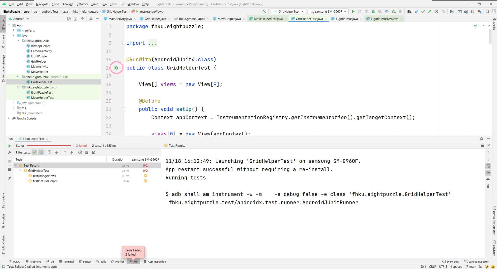

# Übungsblatt 6

Im Übungsblatt müssen die 3 Klassen `EightPuzzle`, `GridHelper` und `MoveHelper` implementiert werden um das Spiel zu realisieren. Sollten Sie einen anderen Lösungsvorschlag haben, können Sie diesen auch umsetzen.

## Erklärung Touch Bewegung

<div style="display:flex;">
    
</div>

Das `MotionEvent` enthält unterschiedliche Eigenschaften, welche abfragbar sind. Mit `getRawX()` und `getRawY()` erhält man die x- bzw. y-Koordinate der linken oberen Ecke des Fingers auf dem Display. Der Ursprung (0/0) der Koordinaten ist dabei die linke obere Ecke des gesamten Displays.

Mit `getX()` und `getY()` der View erhält man die Koordinaten der linken oberen Ecke der View mit Ursprung der `ContentView` der Activity. Um das "Dragging" zu realisieren soll `diffX` und `diffY` ausgerechnet werden. Dies wäre die Distanz zwischen x/y der View und x/y des Fingers.

Um die x/y Koordinate der View innerhalb jedes `ACTION_MOVE` Events zu errechnen, muss nur `diffX` bzw. `diffY` von der Position des Fingers abgezogen werden. Dadurch erhält man den Effekt, dass die View am Finger "klebt".

```java
public class MainActivity extends AppCompatActivity implements View.OnTouchListener {

    protected float diffX;
    protected float diffY;

    // ...

    @Override
    public boolean onTouch(View view, MotionEvent motionEvent) {
        if (motionEvent.getAction() == MotionEvent.ACTION_DOWN) {
            diffX = motionEvent.getRawX() - view.getX();
            diffY = motionEvent.getRawY() - view.getY();
        } else if (motionEvent.getAction() == MotionEvent.ACTION_MOVE) {
            view.setX(motionEvent.getRawX() - diffX);
            view.setY(motionEvent.getRawY() - diffY);
        }

        return true;
    }
}
```

## Projektaufbau

Im Projekt finden sich 3 Klassen, welche implementiert werden müssen. Konkret handelt es sich um die Klassen `EightPuzzle`, `GridHelper` und `MoveHelper`. Zu diesen 3 Klassen existieren ebenfalls entsprechende Test Klassen.

In den beiden Test Ordnern (`test` bzw. `androidTest`) finden sich die Test Klassen `GridHelperTest`, `EightPuzzleTest` und `MoveHelperTest`. Tests welche im `androidTest` Ordner liegen, müssen auf einem angeschlossenen Gerät ausgeführt werden, Tests aus dem Ordner `test` werden nur lokal ausgeführt.

Mit Klick auf die grünen Pfeile (siehe Screenshot unten) können die Tests ausgeführt werden.



## Klasse EightPuzzle

Innerhalb der Klasse `EightPuzzle` wird die Logik des Spiels hinterlegt. Diese ist unabhängig von der Darstellung und basiert auf einem 2-dimensionalen 3x3 Grid. Die entsprechenden Methoden würden auf Basis des internen Zustands einerseits wichtige Fragen beantorten (zB `canMoveLeft`) bzw. auch wichtige Handlungen durchführen (`move` oder `shuffle`).

Alle Methode mit `TODOs` müssen implementiert werden. Sobald alle Tests positiv sind, ist die Klasse `EightPuzzle` wahrscheinlich korrekt implementiert.

## Klasse MoveHelper

Mit der Klasse `MoveHelper` werden wichtige Operationen durchgeführt, um die Inhalte der Klasse `EightPuzzle` in die Benutzerschnittstelle zu übersetzen. Beispielsweise das `clamping` und die finale Positionierung eines Plättchens.

Alle Methode mit `TODOs` müssen implementiert werden. Sobald alle Tests positiv sind, ist die Klasse `MoveHelper` wahrscheinlich korrekt implementiert.

## Klasse GridHelper

Die Klasse `GridHelper` ist dafür verantworlich die Darstellung des 3x3 Grids zu mischen. Mit der Methode `arange` wird ein 3x3 Grid übergeben, die hinterlegten Views, werden dadurch entsprechend angeordnet. Für diese Klasse ist nur der Konstruktor zu implementieren.

Alle Methode mit `TODOs` müssen implementiert werden. Sobald alle Tests positiv sind, ist die Klasse `GridHelper` wahrscheinlich korrekt implementiert.


