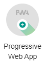

# Fx Calculator

`Fx Calculator` ist eine einfache PWA um Währungen umzurechnen.

## Projekt Setup

Erstellen Sie einen leeren Projektordner auf Ihrem Rechner die Bennenung ist grundsätzlich egal, jedoch `fx-calculator` würde sich anbieten.

Innerhalb des Ordners erstellen Sie eine Datei `package.json`. Als Inhalt der Datei fügen Sie 2 geschweifte Klammern ein:

```json
{}
```

Installieren Sie einen Web-Server zur lokalen Entwicklung mit `npm i http-server --save-dev`. Nach der Installation können Sie ein `script` in der Datei `package.json` hinzufügen um den Web-Server zu starten. Das finale `package.json` sollte folgenden Inhalt aufweisen:

```json
{
  "scripts": {
    "start": "http-server docs -p 8080"
  },
  "devDependencies": {
    "http-server": "^14.0.0"
  }
}
```

Es soll noch ein Ordner `docs` erstellt werden, welcher alle Projektdateien enhält. Durch die Ausführung von `npm start` kann nun die lokale Entwicklung begonnen werden.

!!! info "Hinweis"
    Für ein Deployment auf Github Pages sollten alle Dateien, welche zur App gehören im Ordner `docs` liegen. Dieser Ordner wird dann über einen Web-Server öffentlich bereitgestellt.

Es sollen ebenfalls 4 Bilder ([Icon 1](https://raw.githubusercontent.com/stefanhuber/fx-calculator/master/docs/icon16.png), [Icon 2](https://raw.githubusercontent.com/stefanhuber/fx-calculator/master/docs/icon512.png), [Icon 3](https://raw.githubusercontent.com/stefanhuber/fx-calculator/master/docs/maskable-icon512.png), [Icon 4](https://raw.githubusercontent.com/stefanhuber/fx-calculator/master/docs/icon192.png)) heruntergeladen werden und im Ordner `docs` abgelegt werden.

## HTML/CSS

{: style="max-width:260px;" }

Die Benutzerschnittstelle ist sehr einfach gehalten. Im folgenden findet sich das HTML-Dokument und das zugehörige CSS-Stylesheet:

```html
<!DOCTYPE html>
<html lang="en">
<head>
    <meta charset="UTF-8">
    <meta name="viewport" content="width=device-width, initial-scale=1.0">
    <meta http-equiv="X-UA-Compatible" content="ie=edge">
    <meta name="description" content="FX-Calculator Demo PWA">
    <title>Fx Calculator PWA</title>
    <link rel="stylesheet" href="style.css">   
</head>
<body>
    <main>
        <h1>Fx Calculator</h1>
        <section>
            <label for="input-value">Input</label>
            <input id="input-value" type="number" name="input-value">
            <select title="Input Currency" name="input-currency"></select>
        </section>
        <section>
            <label for="output-value">Output</label>
            <input id="output-value" name="output-value" readonly>
            <select title="Output Currency" id="output-currency" name="output-currency"></select>
        </section>
        <button>Calculate</button>
    </main>
</body>
</html>
```

```css
body {
    margin:0;
    background:#ccffcc;
    font-family: sans-serif;
}
h1 {
    text-align: center;
}
main {
    padding:10px;
}
section {
    border:1px solid black;
    padding:5px;
    margin-bottom:5px;
    display:flex;
    justify-content: space-between;
    align-items: center;
}
section label {
    flex: 0 0 60px;
}
section input {           
    flex: 1 1 100%;
    padding: 4px;   
    border:1px solid #aaa;
    border-right: none;
    outline:none;
}
section select {
    flex: 0 0 60px;
    padding:3px;
    border:1px solid #aaa;
    border-left: none;
}
button {
    border:1px solid black;
    background:white;
    width:100%;
    padding:8px;
}
```

Diese beiden Quellcodeabschnitte sind jeweils in die Datei `docs/index.html` bzw. `docs/style.css` zu kopieren.

## Verhalten

Das gesamte Verhalten der Applikation findet sich in der Datei `app.js`, welche entsprechend zu erstellen ist. Die Datei ist ebenfalls in das HTML-Dokument einzubinden:

```html
<script src="app.js" async></script>
```

### Dropdown Inhalt füllen

Es gibt zwei Dropdowns (`select`), welche noch keine Inhalte (`option`) haben. Da die beiden Dropdowns dieselben Inhalte haben, können diese dynamisch gefüllt werden.

Mit der Funktion `querySelectorAll` sollen alle Dropdowns ausgewählt werden. `querySelectorAll` liefert eine [`NodeList`](https://developer.mozilla.org/en-US/docs/Web/API/NodeList) als Resultat.

Mit der Funktion [`forEach`](https://developer.mozilla.org/en-US/docs/Web/API/NodeList/forEach) der `NodeList` kann durch die Ergebnismenge iteriert werden. Über die Eigenschaft [`innerHTML`](https://developer.mozilla.org/en-US/docs/Web/API/Element/innerHTML) wird der HTML-Inhalt des entsprechenden Elements angegeben.

```javascript
document.querySelectorAll('select').forEach(element => {
    element.innerHTML = `
        <option value="EUR">EUR</option>
        <option value="USD">USD</option>
        <option value="CHF">CHF</option>
        <option value="SEK">SEK</option>
        <option value="BTC">BTC</option>
    `;
});
```

### Funktion zur Währungsumrechnung

Um aktuelle Währungskurse abzufragen kann die [Fixer API](https://fixer.io/) verwendet werden. In der [Dokumentation](https://fixer.io/documentation) wird der `Latest Rates Endpoint` beschrieben, welcher im Kontext des Währungsrechners verwendet werden kann. Die Struktur des Endpoints sieht so aus, dass `base` eine Ausgangswährung und als `symbols` Zielwährungen angegeben werden können:

```
https://data.fixer.io/api/latest?base=EUR&symbols=USD,SEK,CHF&access_key=API_KEY
```

Das Ergebnis des Aufrufes sieht folgendermaßen aus:

```json
{
    "success": true,
    "timestamp": 1591604165,
    "base": "EUR",
    "date": "2020-06-08",
    "rates": {
        "USD": 1.130998,
        "SEK": 10.395589,
        "CHF": 1.088433,
        "BTC": 0.000022
    }
}
```

Da die Fixer API mittlerweile einen `API-Key` benötigt und ab 1000 Aufrufen/Monat kostenpflichtig ist, soll die API [gemockt](https://en.wikipedia.org/wiki/Mock_object) werden. Dazu kann einfach eine Antwort der API als JSON-Dokument abgelegt und anstelle der richtigen API abgefragt werden. Es sollte dazu eine Datei `docs/fixer.json` angelegt werden und das JSON-Beispiel von oben hineikopiert werden. Die Kurse können natürlich nach belieben angepasst werden.

```javascript
// const fixerUri = 'https://data.fixer.io/api/latest?base=EUR&symbols=USD,SEK,CHF&access_key=API_KEY';
const fixerUri = "fixer.json";
```

Um nun die tatsächliche Währungsumrechnung durchzuführen soll eine Function `convert` erstellt werden. Da diese Funktion immer den aktuellen Währungskurs über die API abfragen soll, wird diese als `async` deklariert. Als Übergabeparameter bekommt die Funktion den Ausgangswert (`inputValue`), die Ausgangswährung (`inputCurrency`) und die Zielwährung (`outputCurrency`). Als Rückgabewert soll die Funktion den Ausgangswert in die Zielwährung umrechnen.

Da die Funktion als `async` deklariert ist, kann `await` für asynchrone Aufrufe wie zum Beispiel `fetch` verwendet werden. Im ersten Schritt werden also die Währungskurse über die Fixer API abgefragt und der Response-Body (welcher als String repräsentiert ist) in eine JSON-Repräsentation überführt (`response.json()`). Der Rest der Funktion führt die Währungsumrechnung durch:

```javascript
async function convert(inputValue, inputCurrency, outputCurrency) {
    const response = await fetch(fixerUri);
    const data = await response.json();
    const rates = data['rates'];
    rates["EUR"] = 1.;
    return inputValue / rates[inputCurrency] * rates[outputCurrency];
}
```

Um das Runden von Währungen auf fixe Dezimalstellen durchzuführen wird noch eine `round` Funktion implementiert:

```javascript
function round(value, decimals) {
    return (Math.round(value * 100) / 100).toFixed(decimals);
}
```

### Button Click

Um nun die eigentliche Aufgabe der App zu realisieren wird ein EventListener für das Click-Event auf dem Button registriert. Der anonyme EventListener ist ebenfalls als `async` deklariert, da die Funktion `convert` mit `await` aufgerufen wird. 

```javascript
document.querySelector('button').addEventListener('click', async () => {        
    const inputCurrency = document.querySelector('[name="input-currency"]').value;
    const outputCurrency = document.querySelector('[name="output-currency"]').value;    
    const inputValue = document.querySelector('[name="input-value"]').value;
    const outputValue = await convert(inputValue, inputCurrency, outputCurrency);
    document.querySelector('[name="output-value"]').value = round(outputValue, 2);            
});
```

Die Funktion selektiert alle wichtigen Werte aus dem DOM, welche für die Berechnung wichtig sind (`inputCurrency`, `outputCurrency` und `inputValue`). Diese Parameter werden an die Funktion `convert` übergeben und das Ergebnis wird am entsprechenden DOM-Element gesetzt. Für eine schönere Darstellung wird noch die Funktion `round` genutzt, um den Zielbetrag auf 2 Dezimalstellen zu runden.

## Zwischenstand mit Lighthouse prüfen

Die App ist nun vollkommen funktionsfähig umgesetzt. Die Prüfung mit Lighthouse zeigt ebenfalls ein passables Bild:


Die fehlenden 100 bei den Best Practices resultieren daher, dass der lokale Web-Server kein `HTTP/2` unterstützt, dies wird über ein Deployment auf zum Beipsiel [Github Pages](https://pages.github.com/) beseitigt.

Die PWA hat 3 Aspekte, welche mit Lighthouse geprüft werden:

 - Fast and reliable
 - Installable
 - PWA Optimized

Zumindest `Installable` und `PWA Optimized` sind derzeit noch unzureichend unterstützt.

## Web-App Manifest

Für Web-Apps welche am Homescreen installierbar sein sollen, muss ein [Web-App Manifest](https://developer.mozilla.org/en-US/docs/Web/Manifest) erzeugt und im HTML verlinkt werden. Der Name des JSON-Dokuments soll `manifest.webmanifest` lauten.

Das Web-App Manifest ist ein JSON-Dokument mit wichtigen Eigenschaften der App:

 - Jede PWA benötigt zumindest ein Icon, es können für unterschiedliche Ansichten (zB Android Recents) weitere Icons angegeben werden ([icons](https://developer.mozilla.org/en-US/docs/Web/Manifest/icons)). Ein Icon benötigt dabei eine Größenangabe (`sizes`), eine Typangabe (`types`) und eine Zweckangabe (`purpose`).
 - Jede PWA benötigt einen Titel (`name`), darüberhinaus kann auch ein Kurztitel als Abkürzung angegeben werden (`short_name`)
 - Es können Farbwerte für unterschiedliche Ansichten definiert werden (`background_color` oder `theme_color`)
 - Mit `display` wird definiert, ob Teile des Web-Browsers noch angezeigt wreden sollen oder nicht. `standalone` bedeutet die Addressleiste wird versteckt.
 - Mit `start_url` wird angegeben, welche URL der PWA geöffnet werden soll, wenn eine Benutzerin die App vom Homescreen startet.
 - Mit `scope` wird angegeben, welche Pfade Teil der PWA sind und welche nicht. Mit `/` wird angegen das alles unter der Baseurl Teil der PWA ist. Mit `./` wird angegeben das alles ab der relativen Baseurl Teil der PWA ist.

```json
{
    "name": "Fx Calculator",
    "short_name": "Fx Calc",
    "display": "standalone",
    "start_url": "./",
    "scope": "./",
    "background_color": "#cfc",
    "theme_color": "#cfc",
    "description": "Simple Fx Calculator based on fixer.io API",
    "icons": [
        {
            "src": "maskable-icon512.png",
            "sizes": "512x512",
            "type": "image/png",
            "purpose": "maskable"
        }, {
            "src": "icon512.png",
            "sizes": "512x512",
            "type": "image/png",
            "purpose": "any"
        }, {
            "src": "icon16.png",
            "sizes": "16x16",
            "type": "image/png",
            "purpose": "any"
        }
    ]
}
```

Weitere Details zum Manifest und die entsprechende Web-Browser Unterstützung sollte im [Mozilla Developer Network](https://developer.mozilla.org/en-US/docs/Web/Manifest) nachgeschlagen werden.

Das oben gezeigte JSON soll in die Datei `docs/manifest.webmanifest` kopiert werden. Das Manifest soll im `head` des HTML-Dokumentes über ein `link` eingebunden werden:

```html
<link rel="manifest" href="manifest.webmanifest">
```

## Installable



Die Installierbarkeit einer PWA ist sichergestellt, wenn ein `Web-App Manifest` vorliegt und ein `Service Worker` registriert ist. Der `Service Worker` kann auch eine leere JavaScript Datei sein.

Es soll dazu eine leere `sw.js` Datei erstellt werden. Im HTML-Dokument soll des Weiteren ein Skript-Tag angegeben werden, welches die Registrierung des `Service Workers` enthalten soll. Mit `if ('serviceWorker' in navigator)` wird geprüft ob die `Service Worker` Funktionalität im Web-Browser unterstützt wird. 

```html
<script>        
    if ('serviceWorker' in navigator) {
        navigator.serviceWorker.register('sw.js');
    }
</script>
```

## PWA Optimized

Für diesen Aspekt müssen einige allgemeine Einstellungen der PWA vorgenommen werden. Für den Fx Calculator müssen dazu noch ein Apple Touch Icon und eine Theme Color als Meta-Tag hinzugefügt werden:

```html
<meta name="theme-color" content="#ccffcc">
<link rel="apple-touch-icon" href="icon192.png">
```
Um `PWA Optimized` voll zu untersützten wird `HTTPs` benötigt. Dies wird erst durch ein Deployment auf zum Beispiel Github Pages ermöglicht.

## Service Worker Implementierung

Der `Service Worker` wurde über die Datei `sw.js` registriert. Dabei gibt es 2 wichtige Events, welche vom `Service Worker` bearbeitet werden können:

 - `Install-Event`: Dieses Event wird getriggert, wenn der `Service-Worker` das erstemal installiert wird. Dort können zum Beispiel alle Dateien, welche für die PWA benötigt werden bereits geladen und in einen Cache geladen werden.
 - `Fetch-Event`: Dieses Event wird immer getriggert, wenn die App einen HTTP-Request triggert. Der `Service Worker` fungiert dabei ähnlich wie ein Proxy und es können beliebige Strategien implementiert werden.

### Install-Event

Mit dem Schlüsselwort `self` wird der `Service Worker` referenziert und damit können EventListener registriert werden. Der EventListener bekommt dabei ein Event vom Typ [`InstallEvent`](https://developer.mozilla.org/en-US/docs/Web/API/InstallEvent), welches die Methode `waitUntil` aufweist.

An die Methode `waitUntil` kann eine asynchrone Funktion übergeben werden. Der `Service Worker` würde erst in den Status `installed` wechseln, wenn die übergebenen Funktion ihre Aufgabe beendet hat. Im unten angeführten Fall wird ein neuer Cache mit dem Namen `fxcalc-v1` erzeugt und es werden über die Methode `addAll` einige Ressourcen vom Netzwerk geladen und in den Cache gelegt. Die Angaben der Ressourcen nutzen dabei relative Pfade, sodass es egal ist in welchem Ordner sich die PWA am Web-Server befindet.

```javascript
self.addEventListener('install', (event) => {
    event.waitUntil(
        caches.open('fxcalc-v1')
            .then(cache => cache.addAll([
                './',
                './index.html',
                './app.js',
                './icon512.png',
                './maskable-icon512.png',
                './icon192.png',
                './icon16.png',
                './fixer.json',
                './manifest.webmanifest'
            ]))
    );
});
```

!!! info "Hinweis"
    Der `Service Worker` wird nicht im Main-Thread ausgeführt und beeinflusst damit die Performance des Pageloads nicht. Am Besten sehen Sie sich dazu den Pageload im Performance-Tab der DevTools an. Wichtig ist dabei, dass Sie im Application-Tab der DevTools mit `Clear Site Data` alle Caches und sonstigen Daten löschen.

### Fetch-Event

Mit dem Fetch-Event kann die Strategie des `Service Workers` implementiert werden, welche verfolgt werden soll im Umgang mit Caching, Netzwerk-Optimierung und Offline-Verfügbarkeit. Mit der Methode `respondWith` des Events kann dabei spezifiziert werden, welches Ergebnis vom Netzwerk an die Render Engine zurückgegeben werden soll.

Im folgenden wird folgende Strategie implementiert:

 - Falls eine Netzwerkverbindung vorhanden ist, soll diese immer verwendet werden
 - Eine Antwort vom Netzwerk soll immer gecacht werden, sodass sich immer der neueste Stand einer Ressource im Cache befindet
 - Falls keine Netzwerkverbindung vorhanden ist, sollen Ressourcen aus dem Cache geladen werden

```javascript
self.addEventListener('fetch', (event) => {
    event.respondWith(
        caches.open('fxcalc-v1').then((cache) => {
            return fetch(event.request) // erzeug eine Anfrage an das Netzwerk
                .then((response) => { // then: falls die Anfrage erfolgreich ist (online)
                    cache.put(event.request, response.clone());
                    return response;
                })
                .catch(() => cache.match(event.request)); // catch: falls die Anfrage nicht an das Netzwerk gestellt werden konnte (offline)
        })        
    );
});
```

!!! info "Hinweis"
    Es können natürlich viele andere `Service Worker` Strategien implementiert werden. Die Website [serviceworke.rs](https://serviceworke.rs/) zeigt einige Strategien auf. Es können beliebige Strategien implementiert werden, welche natürlich komplett von Ihrem Use-Case abhängen.

## Finale Lighthouse Prüfung

Nachdem alle Komponenten der App inkl. Service Worker implementiert wurden, soll nun ein Deployment auf [Github Pages](https://pages.github.com/) stattfinden. Github Pages ermöglicht `HTTP/2` und `HTTPs`, sodass alle offenen Punkte von Lighthouse behoben werden konnten. Das Ergebnis sollte folgendermaßen aussehen (inkl. Easteregg):


Eine vollständige Lösung des Projekt bis zu diesem Punkt, findet sich als App auf [Github Pages](https://stefanhuber.github.io/fx-calculator/) sowie der Quellcode innerhalb eines [Git-Repositories](https://github.com/stefanhuber/fx-calculator).

## Aufgabe: Installation Prompt

Ähnlich wie im Beispiel der [Simple PWA](https://stefanhuber.github.io/mobile-web-demos/simple-pwa/) soll ein eigener Prompt-Mechanismus integriert werden, welcher die Benutzerin anfragt, ob die PWA installiert werden soll. Die grafische Darstellung des Prompt soll in etwa der Ansicht im Screenshot entsprechen:

{: style="max-width:260px;" }

Folgende Aspekte für den Prompt sind zu beachten:

 - Es soll das Event `beforeinstallprompt` abgehört werden und der eigene Prompt wie im Screenshot dargestellt, soll angezeigt werden.
 - Wenn die Benutzerin in der Anfrage `Yes` angibt, soll der Browser-Prompt gezeigt werden (Nutzung der Funktion `prompt` des [BeforeInstallPromptEvent](https://developer.mozilla.org/en-US/docs/Web/API/BeforeInstallPromptEvent)) und das eigene Prompt wieder geschlossen werden.
 - Wenn die Benutzerin die Anfrage mit `No` beantwortet, soll nur das eigene Prompt geschlossen werden und sonst nichts passieren.
