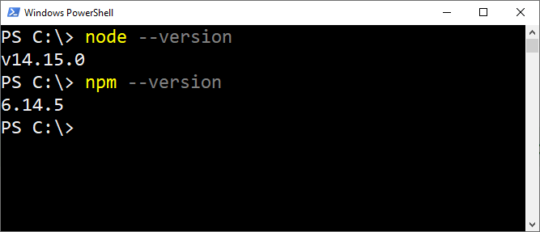

# Aframe 3D Welt

## Vorbereitung

### Voraussetzungen

Damit WebXR Projekte lokal entwickelt werden können, muss [nodejs](https://nodejs.org) installiert werden. Das Command `node` und `npm` müssen über die Kommandozeile ausführbar sein. Innerhalb einer Powershell oder Bash sollten die folgenden Commands ein ähnliches Bild liefern:

{: style="max-width:360px;" }

### Docs Ordner

Das gesamte Projekt soll im Ordner `docs` entwickelt werden. Dieser Ordner kann dann über Github.io öffentlich geteilt werden.

Im Ordner `docs` soll die Datei `index.html` erstellt werden. Der Inhalt dieser Datei soll zB folgendermaßen aussehen:

```html
<html>
    <head>
        <script src="https://aframe.io/releases/1.2.0/aframe.min.js"></script>
    </head>
    <body>
        <a-scene>
            <!-- eigene Inhalte -->
            <a-box position="0 1 -5">
            </a-box>
        </a-scene>
    </body>
</html>
```

### Package Management

Im Projektordner soll eine Datei `package.json` erstellt werden  folgendem Inhalt:

```json
{
    "scripts": {
        "start": "live-server docs"
    }
}
```

Nachdem soll mit `npm i @compodoc/live-server --save-dev` die Bibliothek `live-server` installiert werden. Durch die Ausführung `npm start` im Projektordner wird ein Web-Server gestartet, der bei Dateiänderungen das Projekt im Web-Browser neu lädt.

## 3D-Welt

Es soll eine beliebige und individuelle 3D-Welt mit A-Frame erstellt werden. Diese 3D-Welt soll zumindest folgende Elemente enthalten:

 - Zumindest eine `a-plane` als Boden und ein `a-sky` als Himmel
 - Zumindest eine Animation
 - Zumindest eine Gaze-based Interaction mit einem Element in der 3D-Welt
 - Zumindest ein Element mit einer Textur
 - Zumindest ein importiertes gltf-Modell
 - Zumindest ein Lichteffekt
 - Zumindest ein Audioeffekt

Beispiele für 3D-Welten:

 - Haus mit Türen, Fenster und Garten
 - Hochhaus mit steuerbarem Aufzug
 - Einfache Zugstrecke mit Zug in den man einsteigen kann
 - Einfaches Labyrinth mit einfachem Schalter 

## Veröffentlichung

Der Projektordner soll als Git-Repository initialisiert werden (`git init`). Auf Github soll ein neues Projekt erstellt werden. Mit dem Command `git remote add ...` soll das remote Github Projekt mit dem lokalen Git-Repository verknüpft werden.

Auf Github soll für das Projekt `Github Pages` eingerichtet werden in den Settings (siehe [Github Pages](https://pages.github.com/)). Mit `git push` werden die Inhalte aus dem `docs` Ordner auf der Domain `username.github.io/projectname` veröffentlicht werden.

!!! info "Hinweis"
    Es soll eine sinnvolle `.gitingore` Datei erstellt werden um `node_modules` zu ignorieren.

